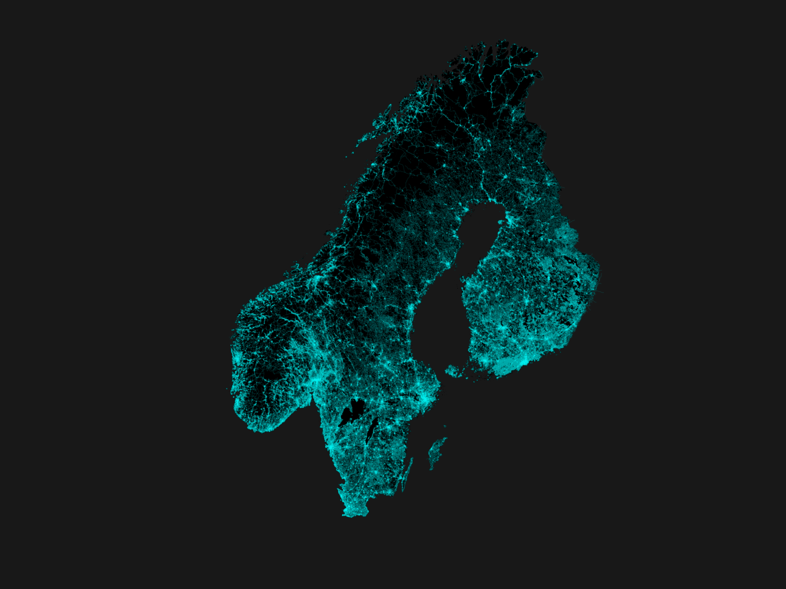
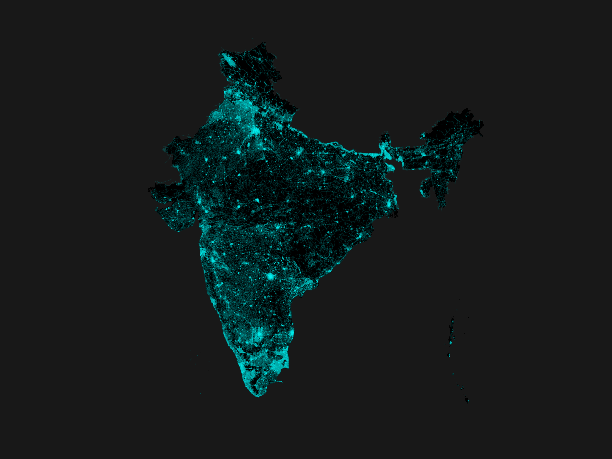
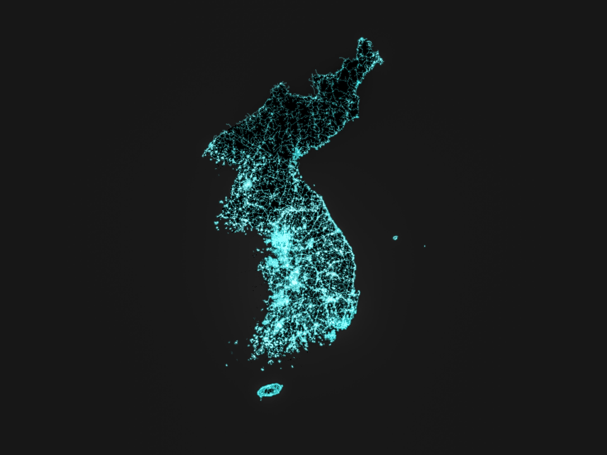
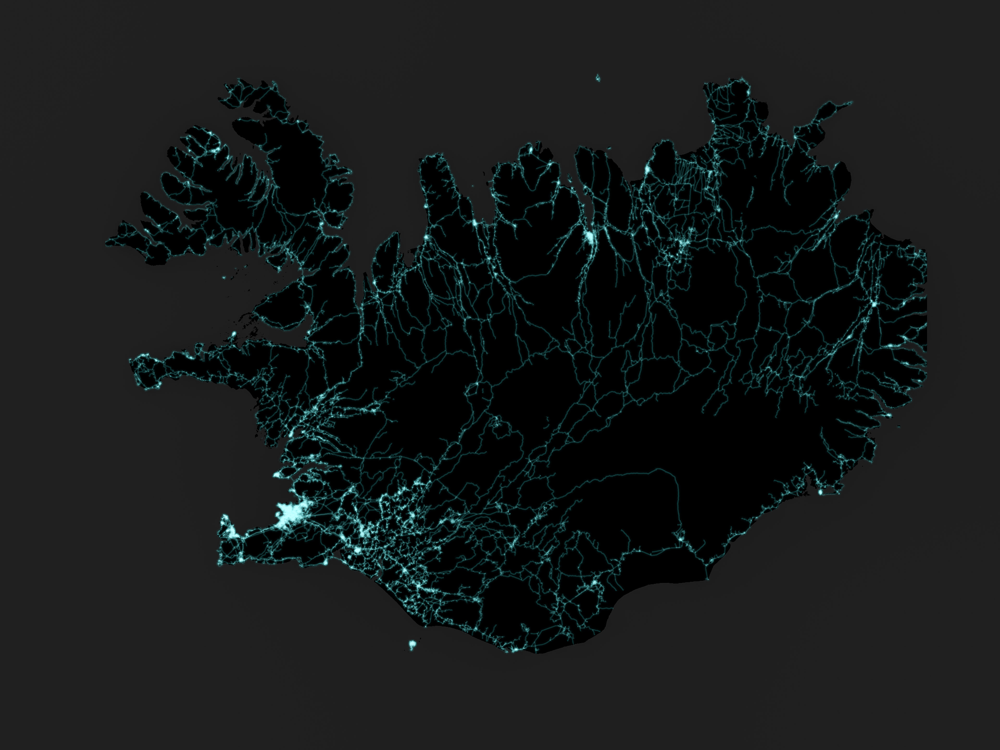
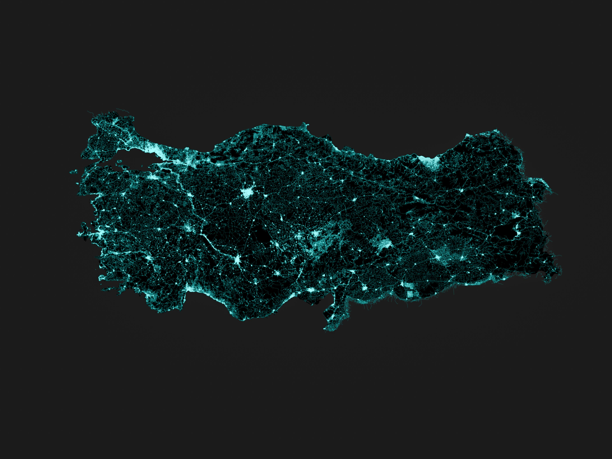
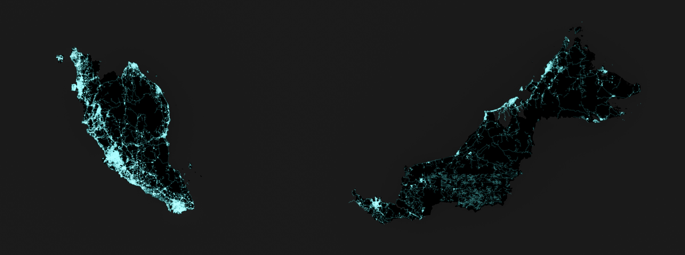
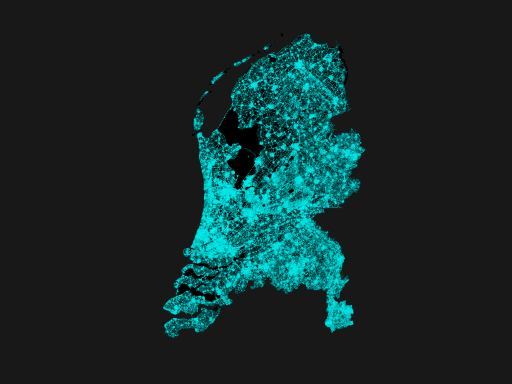
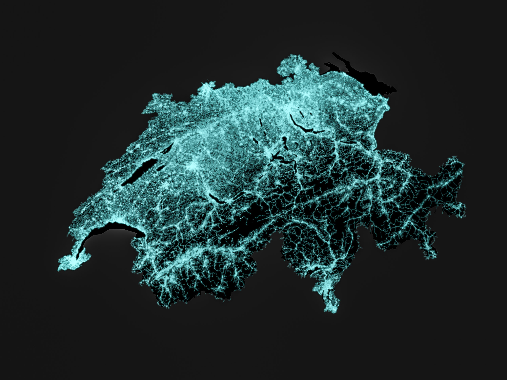

# world-roads

Visualization of roads at country level.

Made with [Python 3.6.8](https://www.python.org/), [Geopandas 0.5.0](http://geopandas.org/) and [Matplotlib 3.1.0](https://matplotlib.org/). 

Countries rendered: Switzerland 🇨🇭, Iceland 🇮🇸, Korea (South 🇰🇷 and North 🇰🇵), Malaysia 🇲🇾, Turkey 🇹🇷, Netherlands 🇳🇱, India 🇮🇳, Finland 🇫🇮, Sweden 🇸🇪, Norway 🇳🇴.

## Data Sources

- Country Border Shapefile: [DIVA-GIS](https://www.diva-gis.org/gdata)
- Roads Shapefile: [Geofabrik](http://download.geofabrik.de/index.html)

## Visualizations

### **Scandinavia: Norway, Sweden, Finland** 🇫🇮 🇸🇪 🇳🇴

### **India** 🇮🇳

### **Korean Peninsula** 🇰🇷 🇰🇵

### **Iceland** 🇮🇸

### **Turkey** 🇹🇷

### **Malaysia** 🇲🇾

### **Netherlands** 🇳🇱

### **Switzerland** 🇨🇭

